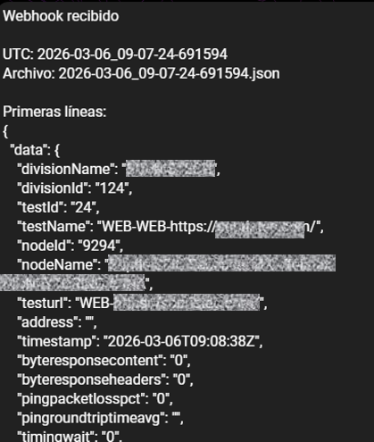

# Webhook Listener

Este proyecto implementa un servidor simple en Flask (`webhook.py`) diseñado para recibir webhooks (peticiones HTTP POST), guardarlos en archivos locales y enviar notificaciones a Telegram.

## Estructura y Docker

El proyecto está contenerizado usando **Docker**.

- **Dockerfile**: Define la imagen base (`python:3.11-slim`), instala las dependencias y prepara el entorno.
- **docker-compose.yml**: Orquesta el servicio. Define un volumen (`webhookPayloads`) que mapea una carpeta del host (`/home/pi/nextcloud-data/jesus/files/webhookPayloads`) al directorio `/app/received_webhooks` dentro del contenedor. Esto asegura que los archivos JSON recibidos persistan en el disco del servidor host incluso si el contenedor se reinicia.

## Funcionamiento del Código (`webhook.py`)

El script `webhook.py` levanta un servidor HTTP en el puerto 5000 y escucha peticiones POST en la ruta `/webhook`.

### Acceso Público (Ngrok)

Para que el servidor local sea accesible desde internet (necesario para recibir webhooks de servicios externos), el script utiliza **Ngrok** (`pyngrok`).

*   **Dirección Pública**: Ngrok genera una URL pública temporal (ej. `https://a1b2c3d4.ngrok.io`) que redirige el tráfico al puerto 5000 de tu contenedor Docker.
*   **Licencia / Autenticación**: La "licencia" para usar este servicio proviene de la variable de entorno `NGROK_AUTHTOKEN`. Este token se obtiene al crear una cuenta gratuita (o de pago) en [ngrok.com](https://ngrok.com) y es necesario para que el túnel funcione correctamente.

### Manejo de Archivos JSON

Cuando se recibe una petición POST con un cuerpo JSON en `/webhook`, el código realiza lo siguiente:

1.  **Recepción y Validación**: Intenta parsear el cuerpo de la petición como JSON. Si no es un JSON válido, devuelve un error.
2.  **Generación de Nombre**: Crea un nombre de archivo único basado en la fecha y hora actual UTC (ej. `2023-10-27_10-00-00-123456.json`).
3.  **Guardado (IMPORTANTE)**: Guarda el contenido del JSON en un archivo dentro del directorio `received_webhooks`, organizado por carpetas según la fecha.
    *   **¿Modifica el contenido?**: **NO.** El código **no filtra, parsea para extraer campos específicos, ni modifica** la estructura de los datos recibidos.
    *   **Formato**: Lo único que hace es **re-formatear** el JSON para que sea legible (pretty-print). La información y la estructura se mantienen idénticas.
4.  **Notificación**: Envía una notificación a Telegram junto con el archivo completo.

### Suscripción Automática

El bot permite que nuevos usuarios se suscriban simplemente enviando un mensaje al bot.
1.  Cuando envías un mensaje (ej. `/start`), el bot guarda tu `chat_id`.
2.  Recibirás una confirmación de bienvenida.
3.  A partir de ese momento, recibirás todos los webhooks que lleguen al sistema.

## Privacidad y Visibilidad de los Datos

Es importante saber qué ocurre con los datos que recibe este webhook:

*   **¿Son públicos los datos?**: **NO**. Los datos recibidos **no se publican** en ninguna web ni son accesibles por terceros de forma abierta.
*   **¿Dónde van los datos?**:
    1.  **Almacenamiento Local**: Se guardan en el servidor donde corre Docker (en la carpeta mapeada).
    2.  **Telegram**: Se envían de forma privada a los usuarios suscritos en el bot.
*   **Acceso**: Solo las personas con acceso al sistema de archivos del servidor o los usuarios autorizados en el bot de Telegram pueden ver el contenido de los payloads.
